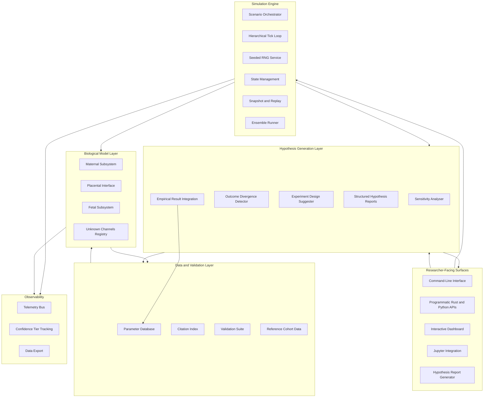
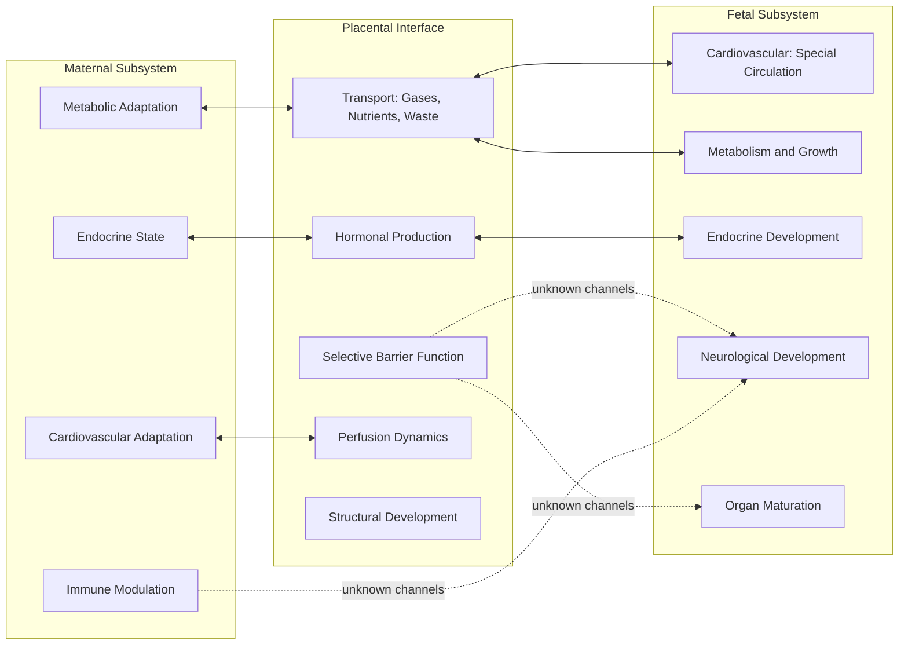
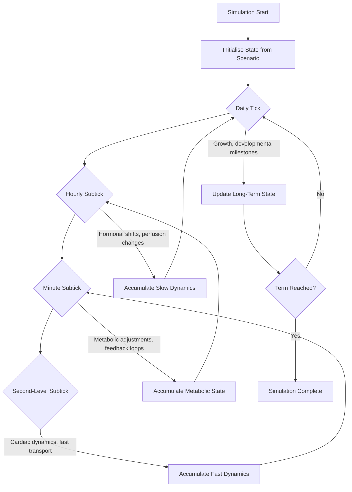
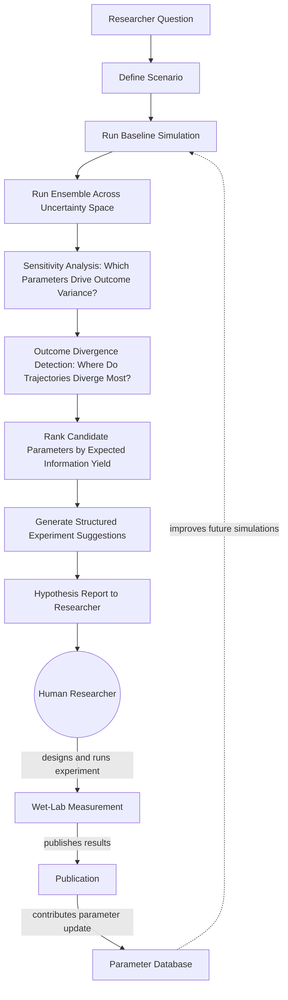

# NIDUS

**A Research Simulator for Human Gestational Physiology**

*Version 0.1.0 — Foundational Specification*

*An open-source, MIT-licensed computational tool for surfacing what we know, what we do not know, and what would be most valuable to measure next about human pregnancy.*

---

## Preface: How to Read This Document

This specification is long because the system it describes is complex, and because one of the project's core commitments is to make its own reasoning transparent. If you are evaluating Nidus for the first time, the first three sections will tell you whether the project is what you are looking for. If you are preparing to contribute, sections four through nine describe the architecture in enough detail to start building. If you are a researcher trying to understand whether the simulator can answer a question you care about, sections ten and eleven describe the hypothesis-generation system and the validation framework, which together determine what kinds of questions Nidus can usefully engage with.

The specification is written in prose because the project's epistemology requires prose. A bulleted list of features would suggest that the features are independent and equally weighted. They are not. The relationships between modules, the reasoning behind architectural choices, and the explicit acknowledgement of what the simulator cannot do are as much a part of the deliverable as the code itself. A researcher who reads this specification and decides Nidus is not the right tool for their question has been served well by the document. A researcher who reads this specification and discovers a question they had not thought to ask has been served better.

---

## Section 1: What Nidus Is

Nidus is a research simulator that models the coupled maternal-fetal physiological system across human pregnancy, from approximately eight weeks gestational age through forty weeks. It integrates current scientific understanding of maternal cardiovascular adaptation, placental transport and endocrinology, and fetal development into a single composable computational substrate. It is deterministic where the underlying biology is mechanistically understood and stochastic where the biology is irreducibly variable. It is built to be reproducible, citable, auditable, and extensible.

The project's defining commitment is that every modelled quantity carries an explicit confidence tier, every parameter is annotated with its scientific source, and every output makes the boundary between established knowledge and active uncertainty visible to the user. Nidus is designed to be honest about its own limits, because dishonesty about uncertainty is what turns a useful research tool into a misleading one.

Nidus exists to serve a specific function in the scientific community. It is a tool that takes the published literature on gestational physiology, organises it into a coherent simulation, identifies the regions of parameter space where outcomes are most sensitive to currently uncertain quantities, and produces structured suggestions for what would be most valuable to measure next. The simulator generates hypotheses; humans evaluate them, design experiments to test them, execute those experiments in physical reality, and bring the results back to update the simulator's parameter database. The loop closes in the laboratory and the clinic, not in software.

The project is licensed under MIT, is implemented primarily in Rust with Python bindings for accessibility, and is built to invite contribution from the scientific community. The architectural decisions throughout this specification are oriented toward making such contribution as easy as possible while preserving the scientific integrity of the simulator.

## Section 2: What Nidus Is Not

Nidus is not a clinical decision support tool. It does not generate recommendations for the care of any specific pregnancy and is not validated for any decision affecting a real patient. The gap between the model and any individual human pregnancy is large, irreducible with current science, and explicitly surfaced in every output the simulator produces.

Nidus is not a control system for a medical device. It is not a step toward replacing human pregnancy. It is a tool for understanding the physiological system that exists, with the explicit purpose of informing the kinds of research that reduce maternal and fetal suffering. The simulator's value to the scientific community comes from its honesty about uncertainty; that honesty would be incompatible with any framing that positioned the simulator as a substitute for empirical biology.

Nidus is not an autonomous AI agent or an automated medical researcher. It is a hypothesis-generation tool with humans in the loop at every empirical step. The simulator can identify which parameters matter most, propose measurements that would resolve key uncertainties, and rank candidate experiments by expected information yield. It does not execute experiments, evaluate biological samples, or replace the judgement of trained researchers. The framing matters because it determines how the tool is used and how its outputs should be interpreted.

Nidus does not model the embryonic period prior to eight weeks, does not model labour and delivery, and does not model twin or higher-order pregnancies in version 0.1.0. Each of these is a substantial modelling problem in its own right and is intentionally deferred to future work.

## Section 3: The Scientific Stance

The project takes a specific and deliberate stance on how to model complex biological systems honestly. Most physiological simulators present a single best-estimate trajectory of system behaviour, with parameters chosen from one source and uncertainty hidden behind clean output plots. This approach is appropriate for some pedagogical purposes but is actively harmful when the simulator is used for research, because it produces results that look more authoritative than the underlying science supports.

Nidus addresses this by treating every modelled quantity as belonging to one of four confidence tiers, with the tier visible in every output the simulator produces. Tier A represents well-characterised mechanism: the underlying physics or chemistry is understood, parameters are measured with good precision across multiple independent studies, and the model is essentially a careful encoding of accepted equations. Examples include the oxygen-haemoglobin dissociation relationship, the basic Fickian diffusion of gases across known membranes, and the fluid mechanics of umbilical blood flow. Tier B represents understood mechanism with parameter uncertainty: the form of the governing equations is settled, but the constants vary meaningfully by population, gestational age, individual, or measurement technique. Examples include placental surface area development across gestation, fetal cardiac output as a function of gestational age, and amniotic fluid turnover dynamics. Tier C represents phenomenology without mechanism: we have observational data showing that something happens, often with reasonable statistical correlation, but we do not have a mechanistic model that would let us predict the outcome from first principles. Examples include the influence of maternal cortisol patterns on fetal hypothalamic-pituitary-adrenal axis development, the dynamics of cellular microchimerism, and many aspects of placental hormonal signalling. Tier D represents speculation and unknowns: the phenomenon is suspected to be important based on indirect evidence but is not well characterised. Examples include the developmental significance of specific maternal exosomal microRNA cargo, the functional role of placental hormones whose receptors have been detected but whose downstream effects are not mapped, and many candidate signalling pathways at the maternal-fetal interface.

The tier system is not documentation about the model; it is structural to the model. Tiers propagate through computations: any output derived from a Tier C input cannot itself be more confident than Tier C, regardless of how confidently the downstream equations operate. Tiers are visible in the user interface, in command-line output, in exported data, and in the hypothesis-generation layer's analysis. The user is never in a position where they can look at a Nidus output and be unsure how confident they should be in it.

This structural honesty about uncertainty is the foundation that the hypothesis-generation layer rests on. A simulator that hides its uncertainty cannot point researchers at the empirical questions that matter, because it has erased the information about which questions are open. A simulator that surfaces its uncertainty becomes a map of where empirical work would be most valuable. That map is the artifact Nidus exists to produce.

## Section 4: Architectural Overview

The high-level architecture of Nidus separates four concerns into clearly distinguished subsystems. The simulation engine is responsible for the deterministic execution of time-stepped models, including state management, seeded randomness, snapshot and replay capability, and the hierarchical tick architecture that allows different physiological processes to operate at their natural timescales. The biological model layer contains the maternal, placental, fetal, and unknown-channel modules that together describe the coupled physiological system. The data and validation layer contains the parameter database, the citation index, the validation suite that tests model behaviour against published reference data, and the reference cohort datasets used for population-level parameter distributions. The hypothesis-generation and observability layer contains the sensitivity analysis tooling, the experiment design suggestion engine, the visualisation systems, and the export formats that allow the simulator to communicate its results outward to researchers.

The relationships between these subsystems can be visualised as follows:



The flow of a typical research session is straightforward. A researcher describes a scenario of interest, perhaps a normal pregnancy with a particular maternal characteristic of interest, or a pregnancy with a specific pathology such as developing preeclampsia. The orchestrator initialises the simulation state and the tick loop advances the simulation while the biological model modules compute their interactions at their appropriate timescales. The output flows to the observability layer with full confidence-tier annotations. If the researcher is interested in hypothesis generation, the same scenario can be run as an ensemble across the documented uncertainty space, and the hypothesis-generation layer can analyse the ensemble to identify which currently uncertain parameters would, if measured, most reduce the uncertainty in outcomes of interest.

## Section 5: The Coupled Biological Model

The biological core of Nidus models the maternal-placental-fetal system as a single coupled physiological system rather than three independent ones. This is the most consequential biological commitment of the project and the one most existing simulators get wrong.

Pregnancy is not a baseline maternal state with a fetus added. The pregnant person undergoes substantial physiological adaptation across pregnancy: maternal blood volume increases by approximately forty percent, cardiac output increases by roughly thirty to fifty percent, insulin sensitivity shifts, immune function is reshaped in ways that protect the fetus while remaining responsive to genuine threats, and dozens of other systems adjust on characteristic timelines. The placenta is not a passive membrane between two circulations but an active, developing organ constructed primarily from fetal tissue under joint maternal-fetal genetic regulation, performing functions equivalent to lung, kidney, liver, immune barrier, and endocrine gland simultaneously. The fetus is not a small human; fetal cardiovascular anatomy includes shunts and patterns of blood distribution that have no postnatal analogue, and fetal metabolism operates on a substrate mix and at oxygen tensions that would be pathological in an adult.

Modelling these three subsystems together, with their bidirectional exchanges treated as first-class system dynamics, is what makes Nidus capable of producing scientifically meaningful output. The architectural relationships between them can be visualised as follows:



The dotted lines in this diagram represent the Tier C and Tier D channels that connect the placental barrier and maternal immune state to fetal neurological and organ development. These are not omitted from the model. They are present as explicit unknown channels with documented hypothesised mechanisms, parameter ranges across which they might operate, and downstream effects they might produce. The hypothesis-generation layer pays particular attention to these dotted lines, because they are the regions where empirical measurement would most improve scientific understanding.

## Section 6: The Tick Hierarchy and Time

Gestational physiology operates across an enormous range of timescales. The fetal heart beats roughly twice per second. Placental gas transport equilibrates over seconds to minutes. Metabolic adjustments unfold over minutes to hours. Hormonal dynamics shift over hours to days. Growth accumulates over days to weeks. Developmental milestones span weeks to months. A simulator that tried to compute everything at millisecond resolution would be computationally wasteful and numerically unstable. A simulator that tried to compute everything at daily resolution would lose essential dynamics. Nidus addresses this through a hierarchical tick architecture in which each physiological process is updated at the timescale appropriate to its dynamics, with information propagated between scales through aggregation and dispatch rules that are themselves part of the simulation specification.

The hierarchical execution can be visualised as follows:



The simulation is fully deterministic given a seed and a scenario specification. A snapshot can be taken at any tick boundary at any tier and serialised to a portable format. A simulation can be paused, snapshotted, transferred to another machine, and resumed without loss of fidelity. This reproducibility is essential for scientific use: a researcher must be able to share a scenario configuration with a colleague and have the colleague reproduce the exact same trajectory, on different hardware, possibly years later. The fixed-point arithmetic used throughout the engine is what makes this bit-exact reproducibility achievable across architectures and compilation modes.

## Section 7: Module Specifications

This section walks through each major module of the system in enough detail for a contributor to understand its responsibilities, inputs, outputs, and key design decisions. The module names correspond to Rust crates in the workspace, with Python bindings exposed through a unified API surface for users who prefer to work in Python.

The simulation engine module, called nidus-core, contains the deterministic runtime. Its responsibilities are managing the hierarchical tick architecture, dispatching subscriber callbacks at their appropriate tiers, providing seeded randomness through a service that allocates independent child generators to each subscriber, maintaining global simulation state, and producing snapshots and replay capability. The engine is intentionally biology-free; it knows about ticks, state, randomness, and observers, but not about placentas or fetuses. This separation makes it possible to test the engine independently of any biological model and to replace biological models without touching the engine. The engine uses fixed-point arithmetic throughout, with types calibrated to the precision needs of biological quantities, because floating-point arithmetic produces small inconsistencies across hardware that, while individually negligible, prevent the bit-exact reproducibility that scientific use requires. The engine is implemented in Rust with strict linting and a forbid-unsafe-code policy in the core crates.

The maternal subsystem module, called nidus-maternal, models the pregnant person as a coupled cardiovascular, metabolic, endocrine, and immune system that adapts across pregnancy. The cardiovascular component exposes maternal cardiac output, mean arterial pressure, and uterine artery flow as functions of gestational age, with parameter trajectories drawn from longitudinal cohort data and stochastic variability layered on top through the seeded RNG service. The metabolic component models substrate availability at the placental interface, including glucose, lipids, amino acids, and lactate, with appropriate adjustments for maternal nutritional state. The endocrine component tracks the pregnancy-specific hormonal axis including human chorionic gonadotropin, progesterone, estrogen, and human placental lactogen. The immune component represents the modulation of maternal immune function during pregnancy, including the shift toward Th2 dominance and the regulation of decidual immune cells. Most cardiovascular and metabolic parameters in this module are Tier A or B; endocrine dynamics are mostly Tier B; immune modulation and its downstream effects on the fetus include substantial Tier C content.

The placental interface module, called nidus-placenta, is the heart of the simulation and the module where Nidus has the most opportunity to contribute to the field. The placenta is the organ that existing simulators handle worst, typically treating it as a passive membrane with constant transport coefficients when in reality it is an active, developing organ whose structure, perfusion, hormonal output, and transport capacity all change across gestation. Nidus models the placenta with five interacting components. The transport machinery handles passive diffusion of gases under Fick's law, facilitated diffusion of glucose under Michaelis-Menten kinetics with documented GLUT1 and GLUT3 parameters, active transport of amino acids and other substrates through their respective transporters, and the transfer of waste products in the opposite direction. The structural development component tracks placental surface area, trophoblast layer maturation, intervillous space perfusion on the maternal side, and umbilical circulation on the fetal side, all as functions of gestational age. The endocrine production component models the placenta's synthesis of pregnancy-specific hormones and their release into maternal circulation. The barrier function component represents the selective transfer of immunoglobulins, the exclusion of many pathogens, and the regulated passage of various other molecules. The unknown channels component represents the suspected but poorly characterised transfers including exosomal cargo, cellular microchimerism, and other transfers whose mechanisms or downstream effects remain Tier C or D. The transport machinery and structural development are mostly Tier A and B; endocrine production is mostly Tier B; the unknown channels are explicitly Tier C and D and are first-class entities in the simulation, not omissions.

The fetal subsystem module, called nidus-fetal, models the fetus as a developing system in active exchange with its environment, with careful attention to the features of fetal physiology that distinguish it from postnatal physiology. The cardiovascular component models the fetal special circulation including the foramen ovale, ductus arteriosus, and ductus venosus, with the resulting preferential delivery of oxygenated blood from the umbilical vein to the brain through the ductus venosus and across the foramen ovale. This anatomical detail matters because it determines how fetal hypoxia manifests and how growth restriction develops, and a simulator that omitted it would produce qualitatively wrong dynamics in clinically interesting scenarios. The metabolic component models the substrate mix delivered by the placenta and tracks the development of fetal insulin signalling and other endocrine functions across gestation. The organ maturation component encodes the characteristic timelines of major organ development including lung surfactant production, hepatic enzyme activity, renal function, gut maturation, and neurological milestones. The neurological development component is the part of the model where Tier C and D content is heaviest; we have substantial knowledge about the timeline of structural neural development and some knowledge about the influence of maternal substrate availability, but the influence of maternal stress hormones, maternal microbiome, exosomal cargo, and other less well-characterised inputs on long-term neurological outcomes remains an active area of research and is represented as such.

The unknown channels registry, called nidus-unknown, is the module without a direct precedent in existing physiological simulators, and it is the module that makes Nidus most distinctively useful as a research tool. Every Tier C or Tier D channel is a first-class entity in the registry with a documented name, a hypothesised mechanism of action, the literature citations supporting and questioning the hypothesis, the parameter ranges over which the channel could plausibly operate, and the downstream effects it might produce if any of those parameter ranges is correct. A researcher can run any scenario with all unknown channels disabled to produce a minimal-model baseline, with specific channels set to particular hypothesised values to test individual hypotheses, or with channels sampled across their full uncertainty ranges to produce ensemble distributions over outcomes. The registry is structured to make it easy to promote a channel from Tier D to Tier C to Tier B as new measurements become available, with full version history of how the model's understanding has evolved.

The parameter database module, called nidus-data, stores every numerical quantity used in the simulation as structured data rather than as code constants. Each entry contains the parameter name, its value or distribution, its confidence tier, its source citation with full bibliographic information and persistent identifiers where available, the population or cohort the value was derived from, the gestational age range over which it applies, and any caveats about extrapolation. Treating parameters as data rather than code is essential because the parameters are the model; the code merely integrates them. Storing them as structured data makes it possible to update them as the literature evolves, to compare alternative parameter sets from different sources, to make the scientific provenance of every simulation result auditable, and to allow researchers to contribute parameter updates through pull requests without needing to touch implementation code.

The validation suite module, called nidus-validation, tests simulator behaviour against published clinical and physiological reference data. For every Tier A and B model component, the suite contains at least one validation test that compares simulator output to a published longitudinal dataset, with quantitative agreement metrics and honest reporting of where the model diverges from reference data. Validation is structurally distinct from verification; verification asks whether the code does what the specification says, while validation asks whether the model matches reality. Both are necessary, and Nidus invests substantially in both. The validation suite produces a public report, updated with each release, that documents which model components are well-validated against multiple independent reference datasets, which are approximately validated against limited data, and which represent areas where current data is insufficient to validate the model in a meaningful sense.

The scenario module, called nidus-scenarios, contains pre-built scenario configurations representing physiologically interesting starting conditions including normal pregnancy across full gestation, pregnancy with moderate gestational diabetes, pregnancy with developing preeclampsia, pregnancy with intrauterine growth restriction, and pregnancy at extremes of maternal age. Scenarios are stored as TOML files, not as code, so that researchers can compose custom scenarios by editing parameters or by inheriting from a base scenario. The scenarios serve as immediately useful starting points for new users and as the basis of regression testing as the model evolves.

The observability module, called nidus-observability, provides the dashboards, telemetry exports, and visualisation tools that turn simulator output into human-readable insight. The most important responsibility of this module is the visualisation of confidence tiers and uncertainty bands; charts always show the tier of displayed quantities, always include uncertainty intervals where applicable, and always allow the user to trace any displayed value back to its underlying parameters and citations. The dashboard is implemented as a web application that can be served locally during a research session or deployed as a static artifact for sharing simulation results with collaborators.

## Section 8: Determinism, Stochasticity, and the Role of Machine Learning

The architectural philosophy of Nidus is that different parts of physiology call for different modelling approaches, and the skill of building a good simulator is knowing which tool fits which part. The mechanistic components of physiology, where the underlying physics or chemistry is well-characterised, are modelled deterministically with carefully cited parameters. The stochastic components, where biological variability is itself part of the system being modelled, are modelled with seeded random processes whose distributions are themselves part of the parameter database. The pattern-recognition components, where the simulator needs to identify structure in complex multidimensional output, can use machine learning techniques, but only supervised learning on real reference data, not reinforcement learning on simulated rewards.

The reason reinforcement learning is excluded from the core simulation loop is that reinforcement learning learns by iterating on its own outputs against a reward signal. In a physiological simulator, the only honest reward signal is agreement with empirical measurements from physical biology. A reinforcement learning loop closed against simulator-internal outputs would converge to whatever attractor the simulator's internal logic favoured, regardless of whether that attractor corresponded to real biology. This failure mode is well-documented in computational biology and is one of the most common ways that ambitious simulation projects produce results that look beautiful and turn out to be wrong. Nidus avoids it by keeping the learning loop empirical: the simulator generates hypotheses, humans test those hypotheses in physical reality, and the resulting measurements update the parameter database. The loop closes outside the software, where it has to close.

Supervised learning has a legitimate role in the project, but only at specific layers. The hypothesis-generation engine described in section ten uses machine learning techniques to identify patterns in ensemble simulation outputs, to cluster scenarios by their dynamical signatures, and to rank candidate experiments by expected information yield. These are pattern-recognition tasks where the training data is the simulator's own ensemble output and the goal is to summarise that output for human inspection, not to generate new physiology. The visualisation layer uses dimensionality reduction techniques to project high-dimensional simulation output into forms researchers can inspect. These uses of machine learning are bounded, well-scoped, and serve the project's purpose of pointing researchers at the empirical questions that matter most.

## Section 9: The Parameter Database and Citation Infrastructure

The parameter database deserves its own section because it is the part of the project most likely to grow over time and most likely to attract contributions from working scientists. Every numerical quantity in the simulator is stored in the database with full provenance, and contributions to the database are the most natural form of external participation in the project.

Each parameter entry contains a unique stable identifier that other parts of the codebase reference, a human-readable name and description, the value itself stored either as a point estimate with uncertainty or as a full distribution depending on what the source literature supports, a confidence tier from A through D, a citation block containing the full bibliographic record including digital object identifier or PubMed identifier where available, the population or cohort the parameter was derived from with enough detail that a reader can assess applicability to their question, the gestational age range over which the parameter is documented, the measurement technique used to obtain the value with notes on its known limitations, and any caveats about extrapolation. When multiple sources disagree about a parameter, the database stores all of them, documents the disagreement, and uses ensemble methods in simulation to propagate that disagreement into output uncertainty rather than silently choosing one.

The citation infrastructure includes a separate citation index that can be queried independently of the parameter database. A researcher can ask Nidus to list every citation it uses, to filter citations by topic or by tier of the parameters they support, and to generate a complete bibliography of the simulator's underlying literature for any specific simulation run. This is what makes simulator output citable in publications: the scientific provenance of every number is auditable from the output back to the original studies.

The database is implemented as a hierarchy of TOML files organised by subsystem, with a schema enforced by the loading code and validated as part of the test suite. Contributions are accepted through pull requests against the database files, with a documented review process that includes verification of citations against the original sources, assignment of the appropriate confidence tier, and integration testing to confirm that the new parameter does not break existing validation tests.

## Section 10: The Hypothesis Generation Layer

The hypothesis generation layer is the part of Nidus that distinguishes it from a passive simulator and turns it into a tool that actively contributes to research planning. The layer is built on top of the simulation engine and the parameter database, and its purpose is to identify the empirical measurements that would, if made, most reduce the simulator's uncertainty about outcomes researchers care about. The output of this layer is a structured report that researchers can use to inform experimental design.

The conceptual workflow of the hypothesis generation layer can be visualised as follows:



Each stage of this workflow corresponds to a specific component within the hypothesis generation layer, and each component is designed to be both useful in isolation and composable with the others.

The ensemble runner extends the simulation engine to run a scenario many times with parameters sampled from their documented uncertainty distributions. The ensemble runner is aware of confidence tiers and samples Tier C and D parameters more aggressively across their full plausible ranges, while sampling Tier A and B parameters only across their measured uncertainty. The output of an ensemble run is a distribution over trajectories rather than a single trajectory, and that distribution is what the downstream analysis components operate on.

The sensitivity analyser implements global sensitivity analysis techniques to determine which input parameters most strongly influence the variance in specified output quantities. The implementation uses Sobol indices and related variance-decomposition methods, which are well-established in the computational science literature and produce interpretable results that can be ranked. A researcher specifies the outcomes they care about, perhaps fetal growth trajectory or third-trimester oxygen delivery to the fetal brain, and the sensitivity analyser produces a ranked list of the parameters that most determine variance in those outcomes. Parameters at Tier C or D that appear high in this ranking are immediately interesting: they represent quantities that are both uncertain and consequential, and measuring them would meaningfully reduce simulator uncertainty about outcomes of interest.

The outcome divergence detector complements sensitivity analysis by identifying regions of parameter space where trajectories diverge most dramatically. Sometimes the most interesting parameters are not those with the largest average effect but those that act as switches between qualitatively different regimes. The divergence detector uses clustering techniques on ensemble trajectories to identify whether the ensemble exhibits bimodal or multimodal outcomes, and if so, which parameter combinations push trajectories into which regime. This is particularly important for understanding pathological regimes such as the transition into preeclampsia, where a small change in placental physiology may produce a qualitatively different outcome.

The experiment design suggester takes the output of the sensitivity analyser and the divergence detector and produces structured suggestions for what would be most valuable to measure next. Each suggestion includes the parameter whose measurement is being proposed, the current best estimate and uncertainty range for that parameter, the outcomes whose simulator uncertainty would be reduced by measuring it, an estimate of the expected information yield using established experimental design metrics, and a description of the measurement techniques currently available for measuring the parameter. The suggester is not prescriptive; it does not tell researchers what experiment to run, because the choice of experiment depends on the researcher's resources, expertise, and broader scientific context. It provides the information a researcher needs to make that choice well.

The empirical result integration component closes the loop. When a researcher publishes a measurement that updates one of Nidus's parameters, the new measurement can be contributed to the parameter database through a pull request. The pull request is reviewed for citation accuracy, the appropriate confidence tier is assigned, and the validation suite is run to confirm that the new parameter does not break existing tests. Once merged, the parameter becomes part of all future simulations, and the hypothesis generation layer can use the new, tighter parameter constraint to identify the next most valuable measurement to make. Over time, as the community contributes results, the simulator's uncertainty about gestational physiology decreases in exactly the regions where empirical work has been done.

This is the loop that makes Nidus point outward. The simulator does not iterate against itself; it generates hypotheses that humans test in physical reality, and physical reality is what updates the simulator. The convergence the project drives toward is not internal consistency but external accuracy, measured against real biology.

## Section 11: Validation and the Discipline of Honest Modelling

The validation framework deserves explicit treatment because it is what allows Nidus to be useful rather than merely impressive. A simulator that has not been validated against reference data is a piece of computational art; a simulator that has been validated, with the agreement and disagreement honestly reported, is a scientific instrument.

The validation suite contains tests at three levels of granularity. Component-level tests check individual model components against published reference data; for example, the placental gas exchange model is tested against published fetal arterial oxygen saturation ranges, and the maternal cardiovascular model is tested against published longitudinal cohort data on cardiac output across pregnancy. Integration-level tests check the behaviour of coupled subsystems against published clinical observations; for example, the response of the simulator to simulated placental insufficiency is checked against published patterns of growth restriction. Outcome-level tests check that the simulator's distribution of outcomes across an ensemble of normal pregnancies matches published population-level distributions of birth weight, gestational age at delivery, and other observable outcomes.

The validation report, generated automatically with each release and published as part of the project documentation, is structured to be useful to researchers evaluating whether Nidus is appropriate for their question. For each tested model component, the report shows the simulator output, the reference data, quantitative agreement metrics, and a written assessment of where the model agrees with reference data and where it diverges. Divergences are not hidden; they are documented, with hypotheses about their causes and pointers to potentially relevant unknown channels.

The validation suite cannot, by its nature, validate Tier C and D content, because the reference data for those components does not exist. This is not a failure of the validation suite; it is what makes the Tier C and D content scientifically interesting. The hypothesis generation layer takes precisely those unvalidated components and points researchers at the measurements that would allow them to be validated in the future. The simulator's honesty about what it cannot validate is what makes the hypothesis generation layer meaningful.

## Section 12: Repository Structure and Workspace Layout

The repository is organised as a Rust workspace with multiple crates corresponding to the modules described in section seven, plus supporting directories for documentation, scenarios, parameter data, and validation artifacts. The structure is designed to make the relationship between modules clear and to make contribution straightforward.

```
nidus/
├── crates/
│   ├── nidus-core/              # deterministic simulation engine, tick hierarchy, RNG service
│   ├── nidus-maternal/          # maternal subsystem models
│   ├── nidus-placenta/          # placental interface module
│   ├── nidus-fetal/             # fetal subsystem models
│   ├── nidus-unknown/           # unknown channels registry
│   ├── nidus-data/              # parameter database access and citation index
│   ├── nidus-validation/        # validation suite against published reference data
│   ├── nidus-scenarios/         # pre-built scenario configurations
│   ├── nidus-hypothesis/        # hypothesis generation layer including sensitivity analyser
│   ├── nidus-observability/     # dashboards, telemetry, visualisation
│   ├── nidus-cli/               # command-line interface
│   └── nidus-py/                # Python bindings via PyO3
├── data/
│   ├── parameters/              # parameter database TOML files organised by subsystem
│   ├── citations/               # citation index
│   └── reference/               # reference cohort data for validation
├── scenarios/                   # built-in scenario TOML files
├── docs/
│   ├── architecture/            # architectural documentation
│   ├── modules/                 # per-module specifications
│   ├── validation/              # validation reports
│   ├── contributing/            # contribution guides
│   └── tutorials/               # researcher-facing tutorials
├── examples/                    # example notebooks and scripts
├── web/                         # interactive dashboard frontend
└── tests/                       # workspace-level integration tests
```

The workspace is configured to compile with strict linting, the forbid-unsafe-code directive in all core crates, and a policy of zero warnings before any release. The build configuration supports compilation to WebAssembly for the parts of the simulator that need to run in the browser as part of interactive documentation, while preserving full native performance for command-line and Python-binding use.

## Section 13: Step-by-Step Implementation Prompts

This section converts the architecture above into a sequence of concrete implementation prompts you can hand to a coding assistant or work through yourself. Each prompt provides enough context to be executed in a single coherent step and ends with success criteria that allow the work to be evaluated. The prompts are ordered such that each step builds on the previous ones and produces a working, testable artifact before moving on.

The first prompt is the workspace initialisation. The context for this prompt is that you are building Nidus, the open-source research simulator described in this specification, and you are setting up the initial repository structure. The task is to create a Rust workspace with the crate structure listed in section twelve, with strict linting enabled, the forbid-unsafe-code directive in all core crates, an MIT license file, a README drawn from sections one and two of this specification, a contributing guide that explains the confidence tier system, and a code of conduct. The success criteria are that the workspace builds with zero warnings, that clippy is clean across the full workspace, and that a new contributor can clone the repository and run the test suite without external setup beyond a working Rust toolchain.

The second prompt is the confidence tier infrastructure. The context for this prompt is that the single most important architectural commitment of Nidus is that every modelled quantity carries an explicit confidence tier, and this must be a first-class feature of the codebase rather than a documentation convention. The task is to implement a confidence tier enum with the four variants described in section three, a generic tiered value type that pairs any value with its tier and a citation reference, a citation struct with full bibliographic fields, and the propagation rules that ensure derived quantities cannot have a higher tier than their inputs. The success criteria are that a test demonstrates creating tiered parameters with citations, performing arithmetic on them, and observing correct tier propagation, and that the documentation explains the tier system clearly enough that a new contributor can use it without further guidance.

The third prompt is the tick hierarchy and runtime. The context for this prompt is that Nidus uses hierarchical multi-scale time stepping to handle the wide range of timescales in gestational physiology. The task is to implement the tick clock that tracks gestational age, the subscriber trait that allows model components to register at their appropriate tier, the dispatcher that calls subscribers in deterministic order, and the snapshot mechanism that captures full simulation state. The seeded RNG service should use a deterministic stream cipher such as ChaCha20 and should allocate independent child generators to each subscriber to preserve independence under reordering. The success criteria are that the same scenario with the same seed produces bit-identical output across two runs, that snapshot-and-resume produces identical trajectories to continuous simulation, and that subscribers at different tiers receive their updates in correct relative order.

The fourth prompt is the fixed-point numerics. The context for this prompt is that bit-exact reproducibility across hardware requires avoiding floating-point arithmetic in the core simulation. The task is to define fixed-point types appropriate for the major biological quantities including concentrations, pressures, masses, volumes, times, and dimensionless ratios, with arithmetic that has explicit rounding behaviour and overflow checking, and with conversions to and from floating-point at the boundaries of the user-facing API. The success criteria are that arithmetic on these types produces identical results across x86, ARM, and WebAssembly targets, and that out-of-range values produce clear errors rather than silent overflow.

The fifth prompt is the parameter database. The context for this prompt is that all numerical parameters in Nidus are stored as structured data rather than code constants, with full provenance tracking. The task is to define the TOML schema for parameter entries, implement loading and querying with schema validation, and populate an initial set of Tier A parameters covering maternal blood properties, oxygen-haemoglobin dissociation curve constants, gas diffusion coefficients across the placental membrane, and glucose transporter kinetic constants. Each parameter must include a verified citation drawn from a real source that the contributor has personally consulted. The success criteria are that parameters load successfully, that queries return correct values for given gestational ages, that citations are accessible from any parameter, and that the schema validation catches malformed entries before they enter the database.

The sixth prompt is the maternal cardiovascular model. The context for this prompt is that maternal cardiovascular adaptation across pregnancy includes substantial changes in blood volume, cardiac output, and uterine artery flow on characteristic timelines. The task is to implement the maternal cardiovascular subsystem with parameters drawn from the parameter database, producing maternal cardiac output, mean arterial pressure, and uterine artery flow as functions of gestational age with appropriate stochastic variability sampled from the RNG service. The success criteria are that simulated maternal cardiac output across gestation matches published longitudinal data within published confidence intervals and that this match is captured as a validation test in the validation suite.

The seventh prompt is the placental transport model. The context for this prompt is that the placenta transports gases, nutrients, and waste between maternal and fetal circulations through a combination of passive diffusion, facilitated diffusion, and active transport, with transport capacity that depends on placental surface area which itself develops across gestation. The task is to implement gas exchange under Fick's law, facilitated glucose transport under Michaelis-Menten kinetics with documented GLUT1 and GLUT3 parameters, placental surface area development, and the coupling between maternal and fetal blood compositions through the transport machinery. The success criteria are that a normal pregnancy scenario produces fetal arterial oxygen saturations in the published range, and that sensitivity analyses on placental surface area produce growth restriction patterns consistent with the placental insufficiency literature.

The eighth prompt is the fetal cardiovascular special circulation. The context for this prompt is that fetal circulation includes anatomical features without postnatal analogue, including the foramen ovale, ductus arteriosus, and ductus venosus, and these features determine how oxygen is distributed to fetal organs. The task is to implement the fetal cardiovascular model with the three shunts and the resulting preferential oxygen delivery from the umbilical vein through the ductus venosus to the brain via the foramen ovale, coupled to gestational age and to the placental output computed by the placenta module. The success criteria are that simulated fetal cerebral oxygen delivery is preferentially supplied by the most oxygenated blood, matching textbook physiology, and that this is captured as a structural validation test.

The ninth prompt is the unknown channels registry. The context for this prompt is that Tier C and Tier D channels are first-class entities in Nidus, representing things we know or strongly suspect happen but cannot fully characterise. The task is to implement the unknown channel registry with the metadata described in section seven, including hypothesised mechanism, supporting and questioning citations, parameter ranges, downstream effects, and enable-disable-sample modes. Initial channels to register include maternal exosomal microRNA transfer, microchimerism cell transfer, maternal cortisol diurnal influence on fetal HPA axis development, and immunoglobulin transfer dynamics. The success criteria are that a scenario can be run with all unknown channels disabled to produce a minimal model baseline, with specific channels set to particular hypothesised values, or with channels sampled across uncertainty to produce ensemble outputs.

The tenth prompt is the ensemble runner and sensitivity analyser. The context for this prompt is that the hypothesis generation layer needs to run scenarios many times with parameters sampled from their uncertainty distributions, and then identify which parameters most influence outcome variance. The task is to implement the ensemble runner with awareness of confidence tiers and appropriate sampling strategies, and to implement the sensitivity analyser using Sobol indices or equivalent variance-decomposition methods. The success criteria are that ensemble runs produce documented distributions over trajectories, that sensitivity analyses correctly identify high-leverage parameters in test scenarios with known sensitivity structure, and that the analyses produce ranked output that researchers can act on.

The eleventh prompt is the outcome divergence detector. The context for this prompt is that some of the most interesting parameters in physiology are not those with the largest average effect but those that act as switches between qualitatively different regimes. The task is to implement clustering of ensemble trajectories to identify multimodal outcomes, and to map parameter combinations to the regimes they produce. The success criteria are that the detector correctly identifies bimodal outcomes in test scenarios designed to exhibit regime switches, and that the output is usable as input to the experiment design suggester.

The twelfth prompt is the experiment design suggester. The context for this prompt is that the hypothesis generation layer produces structured suggestions for what would be most valuable to measure next, integrating sensitivity analysis output with current parameter uncertainty and available measurement techniques. The task is to implement the experiment design suggester with the output format described in section ten, producing structured suggestions that can be exported as machine-readable artifacts or rendered as human-readable reports. The success criteria are that suggestions correctly identify high-information-yield experiments in test scenarios, that the suggestion format is reviewed by working scientists for usefulness, and that the suggester respects the confidence tier system.

The thirteenth prompt is the validation suite. The context for this prompt is that validation is what makes Nidus credible as a scientific instrument, and the validation suite must test the simulator against published reference data with honest reporting of agreement and disagreement. The task is to identify a foundational set of reference datasets including the NICHD Fetal Growth Studies, published placental Doppler flow ranges, and published fetal cardiovascular developmental data, and to implement validation tests comparing simulator output to these references. The success criteria are that each Tier A and B model component has at least one validation test, that the validation report makes clear what is well-validated and what is not, and that the report is generated automatically with each release.

The fourteenth prompt is the scenario orchestrator and command-line interface. The context for this prompt is that researchers interact with Nidus through scenario files that declaratively describe the simulation to run. The task is to implement the scenario file format, the orchestrator that loads and executes scenarios, and the command-line interface with subcommands for running scenarios, validating the model, listing parameters, listing unknown channels, and producing hypothesis reports. The success criteria are that users can run any built-in scenario with a single command, that output is machine-readable, and that error messages clearly identify scenario configuration problems.

The fifteenth prompt is the interactive dashboard. The context for this prompt is that simulation output needs to be visualised in a way that respects the confidence tier system and allows researchers to explore results interactively. The task is to implement a web-based dashboard that visualises maternal cardiovascular parameters, placental transport, fetal cardiovascular and metabolic trajectories, unknown channel ensemble distributions, and sensitivity analysis output, with confidence tier annotations and uncertainty bands on every chart and citation chains accessible from any displayed value. The success criteria are that a researcher can launch the dashboard, run a scenario, explore the output, and trace any value to its underlying parameters and citations.

The sixteenth prompt is the empirical result integration. The context for this prompt is that the hypothesis generation loop closes when researchers contribute the results of their experiments back into the parameter database. The task is to implement the pull request review workflow for parameter contributions, including citation verification, tier assignment, and integration testing, and to implement the changelog generation that documents how the simulator's understanding has evolved over time. The success criteria are that a researcher can contribute a parameter update through a pull request, that the review process catches malformed or unverifiable contributions, and that the changelog allows readers to see how each parameter has evolved.

The seventeenth prompt is the documentation and example library. The context for this prompt is that a research tool is only useful if researchers can understand and use it, and documentation is a core deliverable rather than an afterthought. The task is to write developer documentation covering architecture and contribution patterns, user documentation covering scenario authoring and output interpretation, and example notebooks demonstrating a normal pregnancy walkthrough, a sensitivity analysis example, an unknown channel exploration example, and a complete hypothesis generation workflow from question to structured suggestion. The success criteria are that a new contributor can build the project, run a scenario, and modify a parameter without requesting help, and that a working scientist can read the documentation and accurately assess whether Nidus is appropriate for their research question.

## Section 14: Contribution Model and Community

The project is built to invite contribution from the scientific community, and the contribution model is structured around the principle that the most valuable contributions are parameter updates derived from published empirical work. A researcher who has published a measurement that updates one of the parameters in Nidus's database can contribute that update through a pull request that includes the new parameter value, the full citation of the publication, the confidence tier assessment, and any caveats about applicability. The review process verifies the citation against the original source, assesses the appropriate confidence tier, and runs the validation suite to confirm that the update does not break existing tests. Once merged, the new parameter becomes part of all future simulations.

Other forms of contribution are also welcome. Unknown channel additions, when a researcher identifies a Tier D or C channel that the registry does not currently represent, are valuable additions to the simulator's representation of open scientific questions. Validation test additions, when a researcher identifies reference data that the validation suite does not currently use, strengthen the project's claim to scientific seriousness. Module implementations, when a researcher wants to extend the simulator to model a system or pathology not currently covered, can be proposed as new crates following the architectural patterns established by the existing modules.

The project will maintain a code of conduct that emphasises scientific honesty, respectful engagement, and the project's stated commitment to reducing maternal and fetal suffering. Contributors are asked to engage in good faith and to remember that the simulator's value depends on its honesty about uncertainty; contributions that would obscure rather than surface uncertainty will be declined regardless of their technical sophistication.

The longer-term aspiration of the contribution model is for Nidus to become a piece of community-maintained scientific infrastructure, in the same way that bioinformatics tools such as samtools or scientific libraries such as scipy are community-maintained. This requires the project to be technically welcoming, scientifically rigorous, and consistent in its review standards. The architectural decisions throughout this specification, including the separation of parameters from code, the structural commitment to tier propagation, and the validation suite that is run on every contribution, are oriented toward making this kind of community maintenance possible.

## Section 15: Roadmap and Future Directions

The version 0.1.0 specification described in this document produces a working, validated, useful research simulator of normal singleton pregnancy from eight weeks through forty weeks gestational age, with hypothesis generation capabilities and a structured pathway for empirical results to update the simulator over time. This is a substantial first release and is intentionally bounded.

Future versions could extend the project in several directions, each of which would be a substantial undertaking in its own right. Modelling of labour and delivery dynamics would add the mechanics of parturition including uterine contraction patterns, cervical biology, and fetal positioning. Modelling of twin and higher-order pregnancies would add the distinct dynamics of multiple gestation. Integration with clinical data through standard formats such as FHIR would allow the simulator to interface with electronic health records for research purposes. Extension of the unknown channels registry as the literature evolves would track the changing frontier of gestational physiology. Specialised scenarios for clinical education would support the use of Nidus as a teaching tool in obstetric and neonatal training programs. Cross-population parameter sets would allow the simulator to model pregnancy across different demographic and geographic contexts, which is essential because much current parameter data is drawn disproportionately from high-income-country cohorts.

The project's longest-term contribution, if it succeeds at what it sets out to do, is to produce a citable, auditable, continuously improving substrate for thinking quantitatively about human gestational physiology. That substrate would serve researchers asking questions about preeclampsia, growth restriction, prematurity, gestational diabetes, and the dozens of other pathologies that produce most of the maternal and fetal suffering in pregnancy. The simulator would not solve those problems; it would help the people working on them ask sharper questions and prioritise their experimental work more effectively. That is the contribution worth making.

## Appendix A: Glossary

The specification uses a number of terms whose meanings may not be obvious to readers from outside obstetrics and computational physiology. This glossary defines the most important ones in prose form.

Gestational age refers to the time elapsed since the first day of the pregnant person's last menstrual period, by convention used as the reference clock for pregnancy timing in clinical practice. Conception occurs approximately two weeks after the start of gestational age, and term pregnancy is approximately forty weeks of gestational age. Trophoblast refers to the layer of cells on the outer surface of the developing embryo that gives rise to the placenta, and trophoblast invasion into the maternal endometrium during implantation is the process by which the placenta establishes its connection to maternal blood supply. The foramen ovale, ductus arteriosus, and ductus venosus are three anatomical shunts in fetal circulation that allow blood to bypass the lungs, which are not used for gas exchange until birth; the foramen ovale connects the right and left atria of the fetal heart, the ductus arteriosus connects the pulmonary artery to the aorta, and the ductus venosus shunts oxygenated blood from the umbilical vein directly to the inferior vena cava. All three close in the days following birth. Preeclampsia refers to a pregnancy-specific syndrome characterised by hypertension and signs of organ dysfunction developing after twenty weeks of gestation, increasingly understood as a consequence of inadequate placental invasion early in pregnancy. Tier A through D refer to the confidence tiers used throughout Nidus, as defined in section three.

## Appendix B: Reference Reading for New Contributors

Contributors new to gestational physiology will find the following sources useful as background. The list is not exhaustive and is intended as a starting point.

Standard reference texts for maternal-fetal medicine include Creasy and Resnik's Maternal-Fetal Medicine and Williams Obstetrics. For placental biology, the journal Placenta and the published outputs of the NIH Human Placenta Project provide ongoing research and review material. For fetal cardiovascular development, published work from the Rudolph laboratory established much of the foundational understanding still in use today. For longitudinal pregnancy cohort data, the Avon Longitudinal Study of Parents and Children, the Norwegian Mother, Father and Child Cohort Study, and the NICHD Fetal Growth Studies are widely cited foundational resources. For computational modelling of pregnancy, published work scattered across the American Journal of Physiology, Placenta, and the Journal of Theoretical Biology provides the modelling literature that Nidus builds on.

Contributors are expected to cite parameters from sources they have personally consulted. The parameter database review process will verify citations against original sources, and citations that cannot be verified will not be merged. This requirement exists to protect the scientific integrity of the simulator and to ensure that every numerical quantity in Nidus can be traced back to a real, verifiable scientific publication.

---

*End of Specification v0.1.0*
