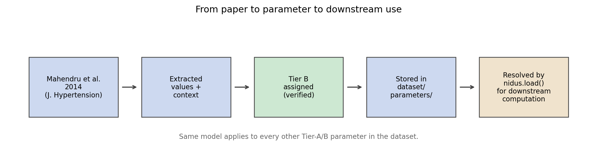
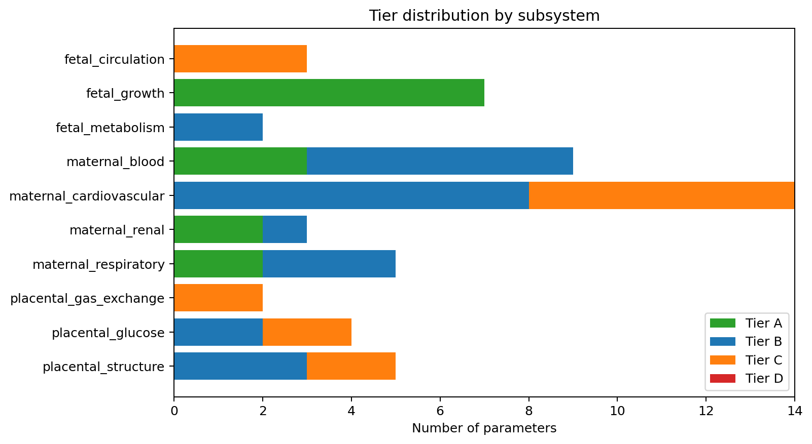
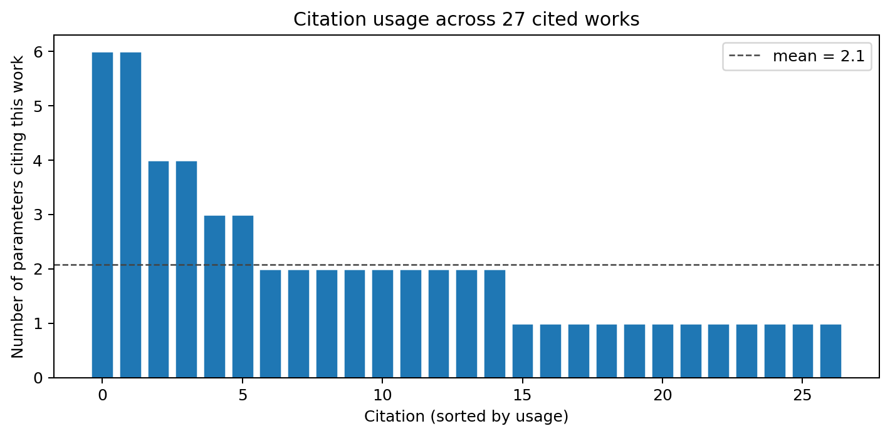

# Confidence tiers for pregnancy physiology

*An essay on the design behind [Nidus](https://github.com/clay-good/nidus), an open dataset of
human gestational physiology parameters.*

---

## A small problem with a clean solution

If you build a computational model of any human physiology, you depend
on parameter values that someone else measured. Cardiac output rises
by some amount during pregnancy. Term placental surface area is around
some number of square metres. Fetal weight at 40 weeks has some
distribution. Every model you write is implicitly a stack of citations
that other people did the work to collect.

The convention in computational physiology is to report each parameter
as a point estimate, sometimes with a confidence interval, usually
with a single citation. What this convention hides is *how much
confidence to place in the parameter itself*. A value drawn from three
independent longitudinal cohorts with overlapping intervals is not the
same kind of object as a value drawn from a single small study, even
when both are written as `4.6 ± 0.4 L/min`. The first is robust; the
second is provisional. The model that consumes both treats them as
interchangeable.

This essay is about a small attempt to fix that, and the
[curated dataset](https://github.com/clay-good/nidus) that demonstrates
the fix on human gestational physiology — a domain where the
confidence question matters, partly because the stakes are high and
partly because the literature is unusually heterogeneous.

## What "Tier B" means

The proposal is four tiers, A through D, applied per-parameter:

| Tier | Label              | Criteria |
| ---- | ------------------ | -------- |
| **A** | Well-established  | Three or more independent peer-reviewed studies. Confidence intervals overlap across studies. Mechanism is biophysically grounded. Validated in at least two distinct populations. |
| **B** | Supported         | One or two peer-reviewed longitudinal studies (n ≥ 100). Plausible mechanism. No strong contradicting evidence. |
| **C** | Provisional       | Single study, or cross-sectional only, or small n. Mechanism speculative or contested. Used as a model parameter only when no better data exists. |
| **D** | Unknown           | No quantitative data in the published literature. Channel or quantity hypothesised but unmeasured. Listed for hypothesis-generation. |

The labels are deliberately ordinary. They are not meant to be a new
contribution — they are meant to be a *standard that is already
familiar to anyone who has used the GRADE evidence framework, or any
academic ranking*, applied at the granularity of individual model
parameters rather than at the granularity of clinical recommendations.

The four-level choice is also deliberate. Three is too coarse: you
lose the distinction between a single careful measurement and no
quantitative data at all. Five or more introduces decision fatigue.
Four matches the existing academic conventions and lowers adoption
friction.

What is novel — or at least uncommon — is the **propagation rule**: a
derived quantity inherits the *lowest* tier among its inputs. A model
that combines a Tier-A measurement with a Tier-C measurement produces
a Tier-C output. The rule is conservative on purpose. A derived
quantity cannot be better-supported than its weakest input, and a
user comparing two model outputs needs the worst-case provenance, not
the best-case.

Two further degradations follow naturally:

- **Out of range.** Tier degrades by one level when a parameter is
  applied outside its validated gestational window.
- **Out of population.** Tier degrades by one level when applied
  outside its declared population (e.g. a singleton parameter used
  for twins).

A Tier-A parameter used both out-of-range and out-of-population
becomes Tier C in the derived quantity. The framework wants the
caller to feel the degradation.

## A worked example: maternal cardiac output

Consider one parameter: the pre-pregnancy baseline of maternal
cardiac output, the reference value against which every pregnancy-
induced change is measured.

The dataset records:

```
id:             maternal_cardiovascular.baseline_cardiac_output_l_per_min
value:          4.6 L/min (low 4.2, high 5.0, one-sigma normal)
tier:           B
primary_citation: mahendru-2014-cardiac-output
```

The primary citation resolves to *Mahendru et al. 2014, Journal of
Hypertension* (DOI 10.1097/hjh.0000000000000090). The paper is a
prospective longitudinal cohort of 53 healthy nulliparous women,
measured from pre-conception through postpartum via inert-gas
rebreathing.

That methodology is rigorous, the cohort is real, and the value
is well-fitted. It is not Tier A: the cohort is small, it is a
single study, and inert-gas rebreathing is one method out of several
in use. Calling this Tier B says explicitly that *one careful
longitudinal study is the evidence base; replication across multiple
independent cohorts would promote it to Tier A*.

A model that uses this value, combined with the cohort's peak-excess
cardiac output figure (also Tier B from the same source), to derive a
mid-pregnancy peak CO, produces a Tier-B output. Worst-input tier
propagates. Good.

If the same model later combines that derived peak with a Tier-C
maternal-fetal flow-distribution parameter to estimate uterine
perfusion, the uterine perfusion is Tier C. The user reading the
model's output knows, without needing to chase citations, that the
weakest link in their chain of inference is the flow-distribution
step.


*From paper to parameter to downstream use. Every Tier-A or Tier-B record
in the dataset follows the same model: the citation chain is recorded,
the extraction method is documented, and downstream computations
inherit the worst-input tier.*

## What the tier distribution looks like in practice

The dataset currently records 243 parameters across thirteen
subsystems spanning maternal cardiovascular adaptation, placental
transport, and fetal development from 8 to 40 weeks gestation.


*Tier distribution by subsystem. The mix tells you something honest
about the field: pregnancy physiology has well-grounded data on
maternal hemodynamics and fetal anthropometry, partial data on
placental transport, and very little on placental endocrinology or
fetal metabolism. The tier system surfaces that unevenness rather
than smoothing it over.*

The current mix is approximately Tier A: 14, Tier B: 25, Tier C: 15,
Tier D: 0. There are no Tier D entries yet, which is itself a signal
— the structured "research questions" channel is open but the
community has not yet contributed to it.

## Citations under the surface

If the tier system is the spine of the dataset, citations are the
ribs. Every Tier A/B parameter must link to at least one citation
with a DOI or PMID, and the citation must be verified against the
original paper by a human (not by an LLM and not from a downstream
review article). The verification standard is documented in
[`docs/contributing/verification.md`](../contributing/verification.md).

When the dataset was first assembled from an earlier prototype, the
DOIs and PMIDs were carried across uncritically. A bibliographic
audit using the Crossref API found that nearly half of those
identifiers — 22 out of 30 — pointed to entirely *different papers*
than what the title and authors described. For example, the
canonical *Mahendru 2014* cardiac-output paper had been stored with
the DOI of a paper about hypertension-induced renal decline by a
completely different first author. The titles, authors, and journals
in the corpus were correct; the identifiers had drifted, probably
during a copy-paste step in the original curation.

The cleanup recovered the correct identifiers by Crossref title-and-
author search, and the cleanup tooling is preserved in the repository
([`scripts/verify_citation_metadata.py`](https://github.com/clay-good/nidus/blob/main/scripts/verify_citation_metadata.py),
[`scripts/repair_citation_identifiers.py`](https://github.com/clay-good/nidus/blob/main/scripts/repair_citation_identifiers.py))
so the next maintainer can detect and fix the same kind of drift
automatically. Bibliographic accuracy is a precondition for tier
credibility; if "Tier A" means "three independent papers say so" then
those three papers have to actually be the papers we think they are.


*How concentrated the dataset's provenance is. A few load-bearing
papers carry most of the weight; a long tail of supporting papers
contribute one or two parameters each. If any of the top sources were
retracted, a substantial fraction of the dataset would need re-tiering.*

## What this is and isn't

The dataset is small. A few hundred parameters across thirteen
subsystems is not a complete model of pregnancy. It is a deliberately
bounded
snapshot of where the published quantitative evidence is strongest,
plus a tier-tagged honest account of where it isn't.

The dataset is **not**:

- A clinical decision-support tool. It is not validated for any
  decision affecting a real patient.
- A mechanistic simulator. The community has good mechanistic
  modelling platforms — [CellML](https://www.cellml.org/),
  [COPASI](http://copasi.org/), [PhysioCell](http://physicell.org/) —
  and competing with them is not the point. The dataset is the
  parameters those simulators would consume. As of `v0.4`, the
  Python package ships first-class exporters into all three
  ecosystems: `nidus export --format sbml|cellml|physiocell|composed|omex`
  produces SBML L3v2 submodels, CellML 2.0 (with 1.1 fallback)
  modules, a drop-in PhysioCell `<user_parameters>.xml`, a single
  composed pregnancy SBML model, and a COMBINE archive bundling all
  of the above with citation-tier annotations preserved through every
  format. The intent is that the nearest mechanistic platform you
  already use is the right place to run a simulation; the dataset
  hands it the inputs in the dialect it speaks.
- A research-validated outcome predictor. It is the inputs, not
  the outputs.
- Automated. Humans verify every parameter against its source PDF;
  LLMs help but do not promote parameters from `unverified` to
  `verified` on their own authority.

The dataset is small enough that a single person can review it end to
end, and that single person is the maintainer of the project. As more
parameters land they will land via the same one-paper-at-a-time
verification flow described in the contributing guide.

## How to use it

The dataset ships as a Python package:

```bash
pip install nidus
```

```python
import nidus

ds = nidus.load()
ds                       # <nidus.Dataset: 243 parameters, 66 citations>

co = ds["maternal_cardiovascular.baseline_cardiac_output_l_per_min"]
co.value.central         # 4.6
co.value.units           # 'L/min'
co.tier                  # 'B'
co.primary_citation.doi  # '10.1097/hjh.0000000000000090'

for p in ds.filter(tier="A"):
    print(p.id, p.value.central, p.value.units)
```

Citations resolve to first-class `Citation` objects on each
parameter, not opaque key strings. Chasing the provenance of any
value is one attribute hop away.

If you'd rather browse without writing code, there is also a
[Streamlit dashboard](https://github.com/clay-good/nidus/tree/main/dashboard)
that loads the same data with a parameter explorer, subsystem
deep-dive, citation provenance graph, and a download page that ships
the dataset as ZIP, per-subsystem JSON, and BibTeX.

A command-line tool comes with the package:

```bash
nidus version
nidus validate                              # check schemas + citations
nidus info                                  # tier distribution + counts
nidus info --subsystem maternal_cardiovascular
```

The dataset itself is licensed CC-BY-4.0; the code is MIT. Both are
forever free. There is no commercial path planned and no premium tier.

## What's missing — open questions worth measuring next

The Tier-D channel is intentionally empty. It is a structured
invitation: if you know a mechanism that pregnancy modelling needs but
the literature does not yet quantify, propose it via the
[research-question issue template](https://github.com/clay-good/nidus/issues/new?template=hypothesis-proposal.yml).

Examples of the kind of thing that would land here:

- Maternal-fetal **exosomal-miRNA traffic**: the literature confirms
  exosomal traffic exists; the quantitative trajectories across
  gestation are not pinned down.
- **Maternal microchimerism**: fetal cells in the maternal
  circulation are well-documented; the dynamics are not.
- **Maternal cortisol** trajectories across gestation as a third-
  trimester programme regulator: qualitative direction is clear; the
  trajectories are not standardised across cohorts.

A Tier-D entry is not a parameter, it is a *structured open question*.
When one or two peer-reviewed studies establish a value range, the
entry is promoted to Tier C and the question is no longer open.

The non-Tier-D gaps are also worth naming honestly. There is thin
coverage of placental endocrinology (hCG, progesterone, lactogen
trajectories are out there but were not curated in the v0.2 source
corpus). There is no fetal-immune coverage. There are no labour
parameters. There are no twin or higher-order pregnancy parameters.
The dataset would be more useful if any of these were filled in by a
human with the patience to walk the literature, and that patience is
what the contributing guide and the issue templates are designed to
reward.

## A small contribution to a small field

Pregnancy physiology is a small field — somewhere between hundreds
and a few thousand researchers globally — and the realistic ceiling
for an open dataset like this one is that a handful of researchers
cite it in their papers and one publishes a hypothesis informed by
it. That is success. Anything more is a bonus.

The bigger ambition is in the *form*. If the tier framework turns out
to be a useful pattern for one small dataset in one small domain,
nothing prevents it from being adopted in larger domains. The
tier definitions are not specific to pregnancy. The propagation
rules are not specific to pregnancy. The JSON Schema is not specific
to pregnancy. None of this is invented here — it is just GRADE-style
reasoning, applied at parameter granularity, with the propagation
rules and the citation-verification standard made explicit and
mechanical.

I think computational physiology in general would benefit from this
discipline, and I think the most useful thing this project can do is
make the discipline concrete enough that other people can adopt or
adapt it without much friction. The dataset is the worked example;
the framework is the contribution.

## How to cite

The dataset is deposited on Zenodo on every release. The Zenodo
concept DOI resolves to the latest version; per-version DOIs are
stable across releases. The machine-readable citation metadata lives
in [`CITATION.cff`](https://github.com/clay-good/nidus/blob/main/CITATION.cff)
at the repository root.

When citing a specific parameter value in a paper, cite both the
dataset (so future readers can find the curated version you used) and
the original primary source for that parameter (so the credit chain
remains intact). Every parameter in the dataset records its primary
citation explicitly; chasing it is one attribute hop.

---

*The code lives at [github.com/clay-good/nidus](https://github.com/clay-good/nidus).
The dataset, the schemas, the verification scripts, the tests, the
dashboard, this essay, and the figures in this essay are all in the
repository. MIT on the code, CC-BY-4.0 on the dataset. Open an
[issue](https://github.com/clay-good/nidus/issues) or a
[discussion](https://github.com/clay-good/nidus/discussions) if you'd
like to contribute.*
